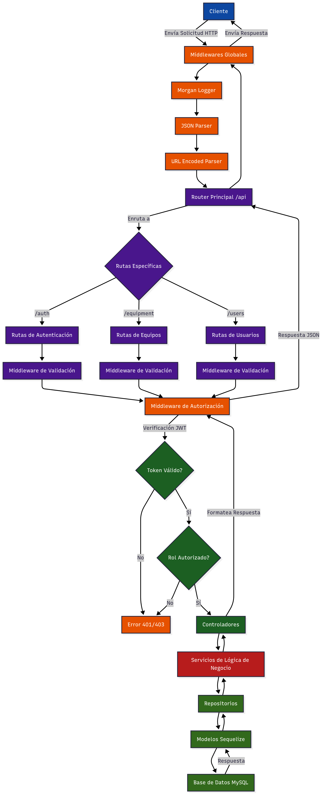

# FORMOTEX - Sistema de Gestión de Inventario

Sistema backend desarrollado en TypeScript para la gestión del inventario de equipos informáticos de la empresa FORMOTEX. Este proyecto es una actividad práctica académica que implementa autenticación JWT, sistema de roles y patrón de arquitectura en capas.

## Flujo de la Aplicación



## Arquitectura Implementada

El proyecto sigue una **Arquitectura por capas** con separación de responsabilidades:

- **Controllers**: Manejo de solicitudes HTTP y respuestas
- **Services**: Lógica de negocio centralizada
- **Repositories**: Abstracción del acceso a datos
- **Models**: Definición de entidades con Sequelize

## Requisitos Previos

- Node.js (versión 18 o superior)
- npm o yarn
- Base de datos (MySQL, PostgreSQL o MongoDB)

## Instalación y Ejecución

1. Clonar el repositorio:

```bash
git clone <url-del-repositorio>
cd formotex-tlpiv-ts
```

2. Instalar dependencias:

```bash
npm install
```

3. Configurar variables de entorno:

```bash
# Crear archivo .env
DB_HOST=localhost
DB_PORT=5432
DB_NAME=formotex
DB_USER=postgres
DB_PASSWORD=tu_contraseña
JWT_SECRET=tu_secreto_jwt
JWT_EXPIRES_IN=1h
PORT=3000
```

4. Ejecutar el proyecto:

```bash
npm run dev
```

## Endpoints Principales

### Autenticación (`/api/auth`)

- `POST /register` - Registro de usuarios (solo admins)
- `POST /login` - Inicio de sesión
- `POST /logout` - Cierre de sesión

### Gestión de Usuarios (`/api/users`)

- `GET /users` - Listar todos los usuarios (solo admins)
- `GET /users/:id` - Obtener usuario por ID (solo admins)
- `POST /users` - Crear nuevo usuario (solo admins)
- `PUT /users/:id` - Actualizar usuario existente (solo admins)
- `DELETE /users/:id` - Eliminar usuario (solo admins)

### Gestión de Equipos (`/api/equipment`)

- `GET /equipment` - Listar todos los equipos
- `GET /equipment/:id` - Obtener equipo por ID
- `POST /equipment` - Crear nuevo equipo (solo admins)
- `PUT /equipment/:id` - Actualizar equipo existente (solo admins)
- `DELETE /equipment/:id` - Eliminar equipo (solo admins)
- `POST /equipment/:id/assign` - Asignar equipo a usuario (solo admins)
- `POST /equipment/:id/unassign` - Desasignar equipo de usuario (solo admins)

### Sistema de Roles

- **Administradores**: Gestión completa de la aplicación, incluyendo usuarios y equipos, con capacidad de asignar y desasignar equipos
- **Usuarios**: Acceso limitado para consultar únicamente los equipos asignados a su cargo

## Diseño de Entidades

### Relaciones Principales

- **Usuario y Equipo**: Relación uno a muchos (1:N)
- **Soft Delete**: Implementado con timestamps paranoid
- **Asignación Dinámica**: Sistema flexible de asignación de equipos

### Propiedades de Entidades

#### Usuario (User)

- `id`, `username`, `email`, `password`, `role`
- Roles: `"admin"` | `"user"`

#### Equipo (Equipment)

- `id`, `name`, `type`, `serialNumber`, `location`, `status`, `purchaseDate`, `userId`

## Sistema de Seguridad

### Autenticación

- Tokens JWT con expiración (1 hora)
- Middleware de verificación de tokens

### Autorización (RBAC)

- **admin**: Acceso completo a todos los endpoints
- **user**: Acceso limitado a sus equipos asignados
- Validación de ownership en recursos

### Validaciones

- Unicidad de email y número de serie
- Campos requeridos en operaciones CRUD
- Enum values para roles y estados
- Password hasheado con bcrypt

## Tecnologías Utilizadas

**Stack Principal:**

- Node.js + Express + TypeScript
- Sequelize (ORM)
- MySQL/PostgreSQL/MongoDB
- JSON Web Token (JWT)
- bcrypt
- express-validator

**Patrones Arquitectónicos:**

- Layered Architecture
- Repository Pattern
- Service Layer
- Dependency Injection
- Middleware Pattern

---

## Justificación Técnica

### Organización de Carpetas

La estructura modular separa claramente las responsabilidades:

- `src/controllers/` - Manejo HTTP
- `src/services/` - Lógica de negocio
- `src/repositories/` - Acceso a datos
- `src/models/` - Definición de entidades
- `src/middlewares/` - Componentes reutilizables

### Elección de Patrones

- **Repository Pattern**: Desacopla la lógica de negocio de la implementación de base de datos
- **Service Layer**: Centraliza la lógica de negocio para reutilización y testabilidad
- **Dependency Injection**: Facilita las pruebas y mantenimiento del código

### Diseño de Relaciones

La relación 1:N entre usuarios y equipos permite una gestión eficiente con asignación flexible y control de acceso basado en ownership.
